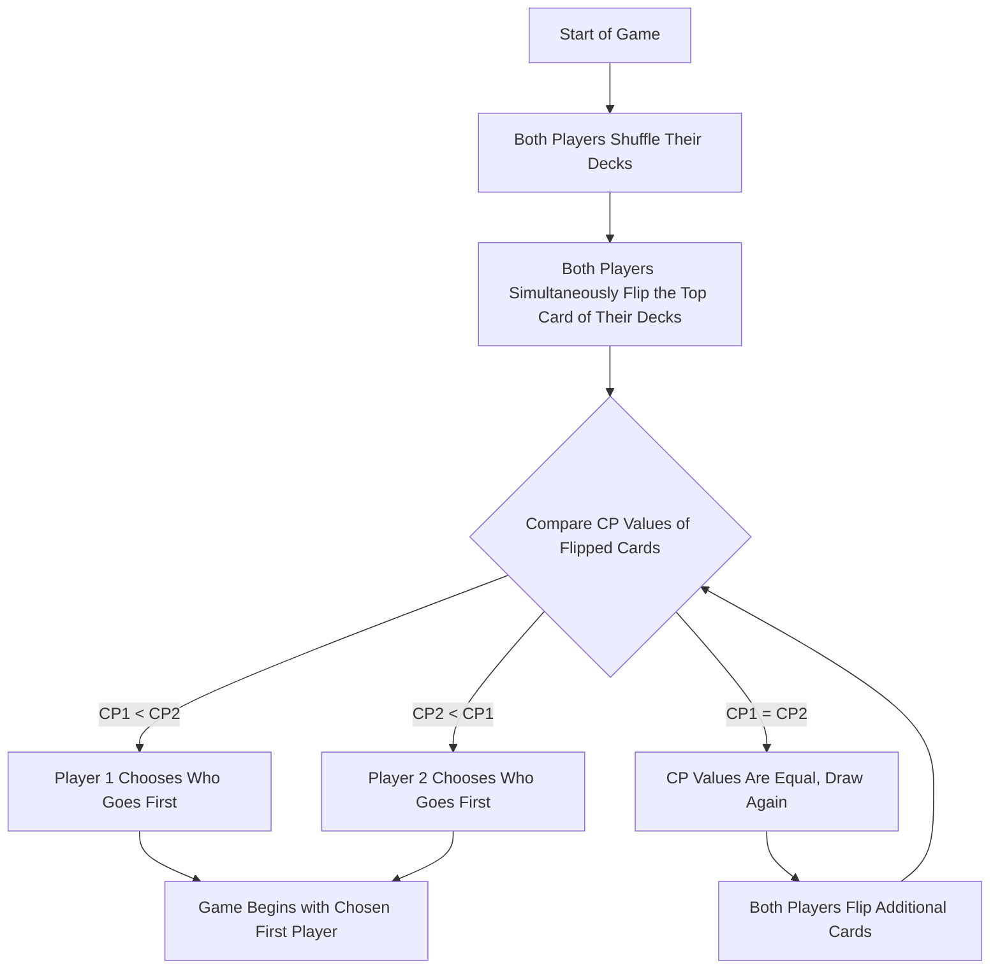
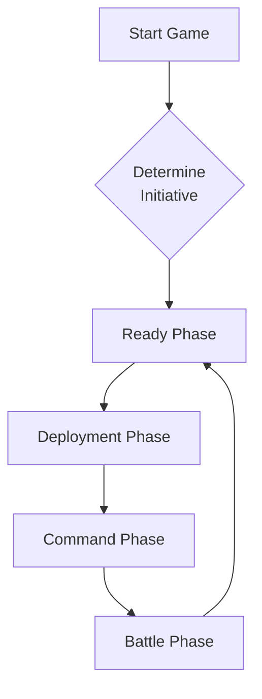
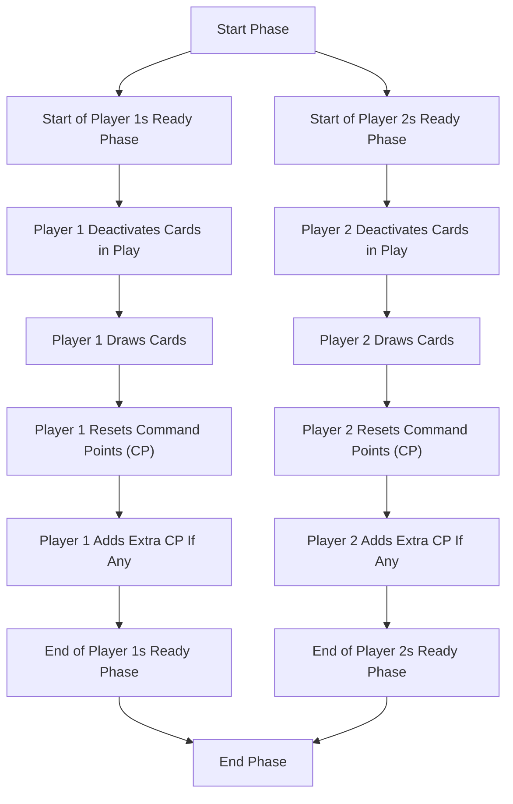
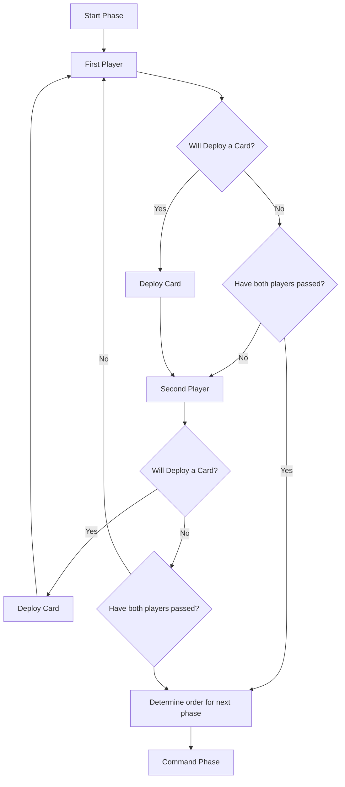
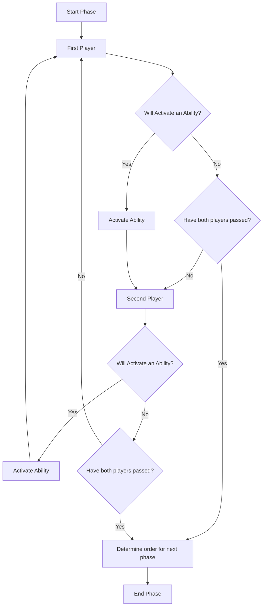
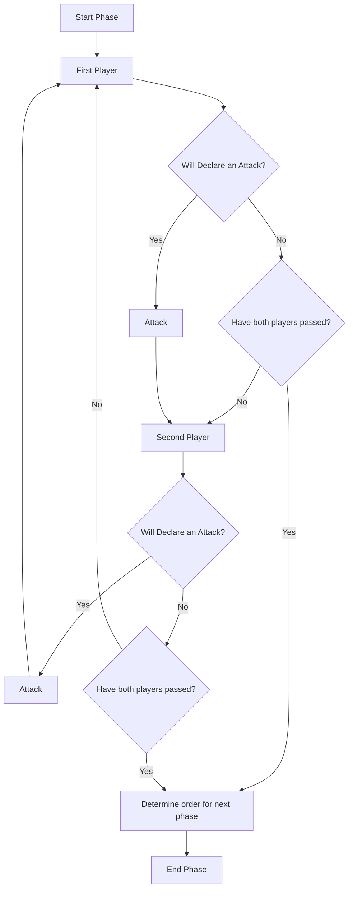
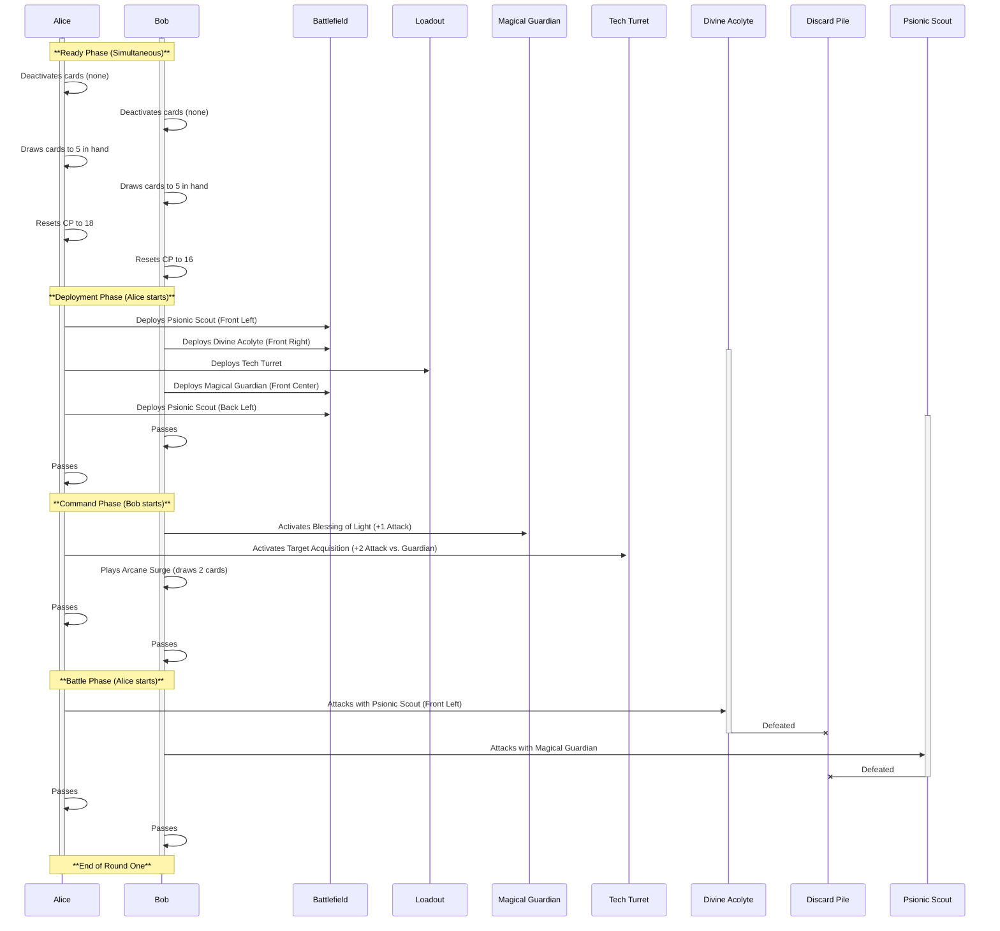
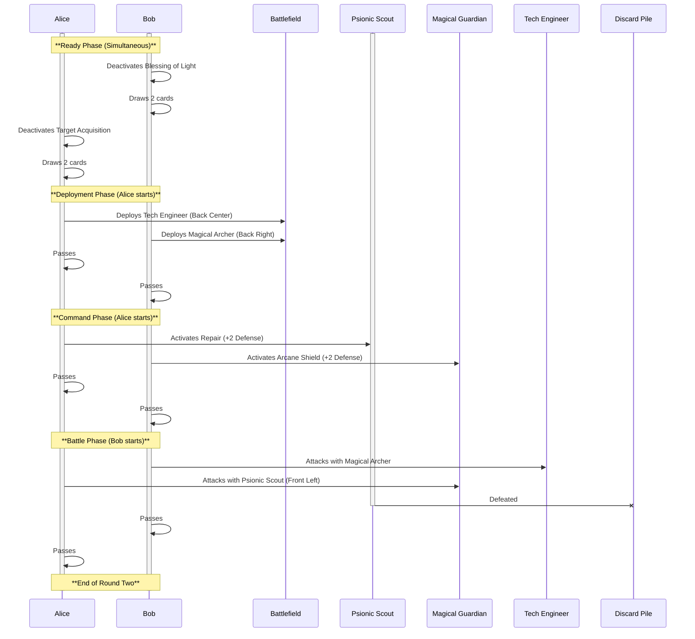

# Quantum Nexus Rules: Detailed Guide

## Note to Players

this rulebook is a comprehensive guide to playing Quantum Nexus. This is the only resource required to learn and understand all of the rules of the game. Quantum Nexus is made of many interconnected systems and it may take a while to learn it. there is a Quantum Nexus Quick Start Guide, to ease new players into the game with a limited rule set. when those are understood, we recommend moving on to this rule book for the full experience.

## I. Introduction to Quantum Nexus

### A. Game Overview

Quantum Nexus is an exhilarating sci-fi trading card game that transports players into a world of strategic battles between advanced civilizations. Players build decks of cards representing various units, leaders, and powerful events to outmaneuver their opponents. The game requires strategic thinking, tactical decision-making, and a deep understanding of card interactions to achieve victory.

The objective of Quantum Nexus is to defeat your opponent by either:

 * Forcing them to draw a card when their deck is empty, or
 * Completing all of your mission cards.

### B. Components

To play Quantum Nexus, you will need the following components:

 * Cards: These are the heart of the game, representing units, leaders, assets, events, upgrades, terrain, and missions. Each card has unique abilities and characteristics that contribute to your overall strategy.
 * Mission Card Area: This designated area is where you place your mission cards face-up at the beginning of the game.
 * Deck: This is where you keep your shuffled deck of cards, drawing from it during your turn.
 * Discard Area: When cards are destroyed or used, they are placed face-up in this area.
 * Loadout Area: This area is specifically for Asset cards, which have persistent effects throughout the game.
 * Battlefield: This is the main playing area where units are deployed and battles take place. The battlefield is divided into quadrants, each with its strategic significance.

### C. Card Attributes

Each card in Quantum Nexus has several key attributes:

 * Command Points (CP): Located in the top-left corner, CP indicates the cost of playing a card. You have a limited amount of CP each turn, so choosing which cards to play is crucial.
 * Type: Cards are categorized into types such as Unit, Leader, Asset, Event, Upgrade, Terrain, or Mission. Each type has distinct functions and roles in the game.
 * Subtype: Subtypes provide further details about a card, such as its faction, affiliation, or special abilities.
 * Rule Box: This section contains the card's abilities, effects, and any special conditions for using it. Understanding the rule box is essential for effective card play.
 * Duplicates: Some cards have restrictions on how many copies you can include in your deck. This ensures deck diversity and strategic balance.

By familiarizing yourself with these components and card attributes, you'll be well-equipped to embark on your Quantum Nexus journey and build powerful decks to challenge your opponents.

## II. Deck Construction

### Construction Basics

In Quantum Nexus, several rules govern deck construction and must all be adhered to. Key constraints include: the deck's total Command Point (CP) value must be exactly 200 CP, ignoring mission cards; no more than 25 CP can be dedicated to Leader type units; the domain points on all Mission cards must total exactly 6, with no single domain exceeding 4 points; and all cards must respect their printed duplicate limits. The following subsections provide further details on these requirements, including specific conditions for Unit cards in relation to Mission cards.

### A. Deck Size

In Quantum Nexus, deck construction is a critical aspect of gameplay. The first rule to remember is that your deck must contain exactly 200 Command Points (CP), ignoring Mission Cards. Each card in the game has a CP value displayed in the top left corner. When selecting cards for your deck, you must ensure the total CP value of all cards adds up to exactly 200. 

This restriction ensures balance and prevents players from overwhelming their opponents with too many powerful cards.

### B. Mission Cards

Mission cards play a significant role in Quantum Nexus, representing your objectives during the game. Your deck can include a maximum of six mission cards. These cards not only grant victory points upon completion but also offer passive effects or powerful abilities.

 * Total Domain Points: Mission cards are associated with four domains: Technology, Magic, Psionics, and Divinity. The total points across all domains on your mission cards must equal exactly 6. This ensures a diverse set of objectives and prevents focusing on a single domain.
 * Single Domain Limit: No single domain on your mission cards can have more than 4 points. This further promotes balance and encourages players to explore different strategies.
 * Zero Points Allowed: It is acceptable to have a domain with 0 points on your mission cards. This allows flexibility in deck building and caters to different playstyles.
 * Starting Command Points: The total CP value of your chosen mission cards determines your starting CP for the game. For example, if your mission cards have a combined CP value of 18, you will begin the game with 18 CP to spend on deploying units and activating abilities.

### C. Unit Cards

Unit cards form the core of your army in Quantum Nexus. They are the ones that engage in combat and fulfill mission objectives. When selecting unit cards for your deck, it's crucial to align them with the domains represented on your mission cards.

 * Matching or Lower Domain Values: Unit cards have domain values associated with them (Technology, Magic, Psionics, Divinity). When including a unit card in your deck, its domain value for any given domain (e.g., Technology) must be equal to or lower than the total number of points assigned to that same domain across all of your chosen Mission cards. For instance, if your collective Mission cards grant a total of 3 points in the Technology domain, any Unit card in your deck cannot have more than 3 points in its Technology domain value. If a Unit card has values in multiple domains, this check must be satisfied for each of those domains against the corresponding total from your Mission
 * There are duplicate limits printed on each card, no card may ever break these limits. They can have an amount of cards lower than the limit, but never higher.

By carefully selecting mission cards and aligning your unit cards with their domains, you can create a cohesive and powerful deck that maximizes your chances of victory in Quantum Nexus.

## III. How to Play

### A. Determining Turn Order (Initiative)

Before delving into the phases of a turn, the first step is to determine who goes first. This is done at the beginning of the game and sets the initial pace.

 * Shuffle: Both players thoroughly shuffle their decks.
 * Flip Top Card: Each player simultaneously flips over the top card of their deck.
 * Compare CP Values: The player with the lower CP value on their revealed card decides who takes the first turn.
 * Tiebreaker: If both players reveal cards with the same CP value, they continue flipping additional cards until one player reveals a lower CP value.
 * First Turn Advantage: Once the starting player is decided, the game begins, and turns proceed clockwise. The player who goes first can gain an advantage by setting up their strategy early in the game.

#### Turn Order Diagram

### B. Game Setup

With the turn order established, the next step is to set up the game.

 * Mission Card Placement: Each player takes their chosen mission cards from their deck and places them face-up in the Mission Card Area. This makes the objectives visible to both players, ensuring transparency.
 * Starting Command Points: Players calculate their starting Command Points (CP) based on the total CP value of their mission cards. The CP numbers of each Mission card are added together and this total is the starting CP. This initial CP pool is crucial for deploying units and activating abilities during the game.

### C. Phases of Play

Each player's turn in Quantum Nexus is divided into four distinct phases. Players alternate turns within each phase, allowing for strategic interactions and decision-making.

#### Ready Phase

 * Ready Phase (Simultaneous): In this phase, both players simultaneously perform the following actions:
   * Deactivate Cards: Return any of your cards currently in an exhausted state (i.e., turned sideways from use in a previous turn) back to their ready state (upright orientation). This makes them available to perform actions again this turn.
   * Draw Cards: Players draw cards from their deck until they have five cards in hand. This replenishes their options for the upcoming turn.
   * Reset CP: The CP pool is reset to the starting value determined by the mission cards.
   * Add Extra CP: If any card effects or abilities grant additional CP at the start of the turn, they are added to the CP pool.
   * Resolve Effects: If any card abilities or effects are triggered for one or both players during the Ready Phase (e.g., "at the start of the Ready Phase..." effects), they are resolved after all other Ready Phase actions (Deactivate Cards, Draw Cards, Reset CP, Add Extra CP) are completed by both players, but before the Deployment Phase begins.
   * On the first turn of the game: The player who won the initial initiative (by revealing the card with the lower CP value and choosing to go first, or being chosen to go first by the winner of the flip) resolves all of their triggered Ready Phase effects first, in an order of their choosing if multiple effects trigger for them. Then, the other player resolves all of their triggered Ready Phase effects, in an order of their choosing if multiple effects trigger for them.
   * On subsequent turns: The player who will have initiative in the upcoming Deployment Phase (as determined by actions in the previous Battle Phase) resolves all of their triggered Ready Phase effects first, in an order of their choosing if multiple effects trigger for them. Then, the other player resolves all of their triggered Ready Phase effects, in an order of their choosing if multiple effects trigger for them.
(See Section VII.A for general rules on resolving stacked effects).

##### Ready Phase Diagram

#### Deployment Phase

 * Deployment Phase (Alternating Turns): This phase is where the action heats up as players deploy their units onto the battlefield.
   * Alternate Placement: Players take turns placing one card at a time from their hand onto the battlefield. Each card has a CP cost, and players must have enough CP to deploy it.
   * Passing: A player can choose to pass their turn, indicating they have finished deploying cards for this phase.
   * Simultaneous Passing: If both players pass consecutively, the phase ends, and the next phase begins.
   * Initiative: The initiative of the Deployment Phase is won by the player who activates the fewest cards (attacks, abilities, interrupts) in the previous Battle Phase, or if there is a tie, the next player in clockwise order from the last player to take action in the previous Battle Phase. If this is the first turn, the player who won the card flip.

##### Deployment Phase Diagram

#### Command Phase

 * Command Phase (Alternating Turns): This phase focuses on activating card abilities and utilizing Event cards for tactical advantages.
   * Activate Abilities: Players take turns activating the abilities of their deployed cards. Each card may have multiple abilities with varying costs and effects. Activating an Active Ability requires paying its specified costs (like CP) and also requires exhausting the card (turning it sideways), unless the ability explicitly states otherwise. A card must be in a ready state to activate an ability that requires it to be exhausted.
   * Play Events: Event cards can be played during this phase for one-time powerful effects. These cards are discarded after use.
   * Passing: If a player has no more abilities to activate or Events to play, they can pass their turn.
   * Iniative: The initiative of the Command Phase is won by the player who deployed the fewest cards (Units, Assets, Terrain, Upgrades) in the Deployment Phase. If all players played the same number of cards, then the player that spent the fewest CP wins. Finally, if all players spent the same CP, the next player in clockwise order from the last player to take action takes initiative.

##### Command Phase Diagram

#### Battle Phase

 * Battle Phase (Declaring Attacks): The Battle Phase is where conflicts erupt as players direct their units to attack their opponent's units.

##### Declaring Attacks and Targeting Principles

The Battle Phase is where units engage in combat. When declaring an attack, players must adhere to several key principles:

   * Target Selection: The attacking player chooses one of their units to attack and an eligible opposing unit as the defender. The eligibility of a defender is determined by the attacker's range (Close, Mid, Far) and the Front-Row Priority rule.
   * Front-Row Priority: Units in an opponent's front row must generally be targeted and defeated before units in that opponent's back row (in the same column/flank) can be targeted by attacks. Specific card abilities might override this.
   * Range and Line of Sight: Each unit's Attack Range (see Glossary and Card Attributes) dictates which quadrants it can target.
   * Player Areas: Attacks are always directed at opposing units in the opponent's play area, respecting the specific range definitions.
   * Declare Attacks: Players take turns declaring attacks, choosing both an attacker and a defender for each attack. When a unit declares an attack, it becomes exhausted (turned sideways).
   * Compare Attack and Defense: The attacker's Attack value is compared to the defender's Defense value. If the attacker's attack value is higher, the defender is destroyed. If the defender's defense value is higher, the attacker is destroyed. If the values are equal, both units remain on the battlefield.
   * Iniative: The initiative of the Battle Phase is won by the player who activated/played the fewest cards (Abilities, Events) in the Command Phase. If all players played the same number of cards, then the player that spent the fewest CP wins. Finally, if all players spent the same CP, the next player in clockwise order from the last player to take action takes initiative.

##### Battle Phase Diagram

### D. Turn Structure

Each player takes turns in Quantum Nexus, progressing through four distinct phases. Turns are dynamic, with actions alternating between players within each phase, fostering strategic interaction and decision-making. The concept of initiative determines who acts first in a given phase.

#### Initiative: Determining Turn Order within Phases

Initiative determines which player acts first within the alternating phases (Deployment, Command, Battle). It is generally awarded based on efficiency in a previous phase (fewest actions or Command Points spent). However, the specific actions counted and the relevant preceding phase depend on the current phase. Please consult the detailed initiative rules provided in the description of each phase below for precise determination.

##### Tiebreaker

If all players activated/deployed the same number of cards in the previous phase, then the player who spent the fewest Command Points (CP) in that phase has the initiative. If all players spent the same CP, then the next player in clockwise order from the last player to perform an action takes initiative.

##### Exceptions

 * Simultaneous Actions: In phases where both players act simultaneously (like the Ready Phase), there is no initiative.
Example:
 * Deployment Phase: On the first turn, the player who reveals a card with a lower CP value has the initiative. In subsequent turns, initiative is determined by the actions taken in the previous Battle Phase.

##### Important Note

The Battle Phase determines initiative for the next turn's Deploy Phase. The player who activates the fewest cards (attacks, abilities, interrupts) in the Battle Phase has the initiative in the next Deploy Phase. If there's a tie, the player who spent the fewest CP in the Battle Phase gets the initiative. If the players spent the same CP, then the next player in clockwise order gains initiative.

#### Additional Notes
 
First Turn Initiative: At the beginning of the game, the player with the lower CP value on their revealed card decides who takes the first turn (initiative).

### Example of Play

#### Game Setup

Alice and Bob decide to play a game of Quantum Nexus. They each have constructed their decks according to the rules.

 * Alice's Deck Focus: Technology and Psionics
 * Bob's Deck Focus: Magic and Divinity

They shuffle their decks and each draw the top card to determine who goes first. Alice draws a card with a CP of 3, and Bob draws a card with a CP of 5. Alice wins the initiative and chooses to go first.

#### Round One

##### Ready Phase (Simultaneous)

 * Both players deactivate any cards they had in play from previous turns (none on the first turn).
 * They draw cards until they have five in hand.
 * They reset their CP to the value determined by their mission cards. Let's say Alice starts with 18 CP, and Bob starts with 16 CP.

##### Deployment Phase (Alice Starts)

 * Alice: Deploys a "Psionic Scout" unit (2 CP) to the Front Left quadrant. (16 CP remaining)
 * Bob: Deploys a "Divine Acolyte" unit (3 CP) to the Front Right quadrant. (13 CP remaining)
 * Alice: Deploys a "Tech Turret" asset (4 CP) to her Loadout Area. (12 CP remaining)
 * Bob: Deploys a "Magical Guardian" unit (4 CP) to the Front Center quadrant. (9 CP remaining)
 * Alice: Deploys another "Psionic Scout" unit (2 CP) to the Back Left quadrant. (10 CP remaining)
 * Bob: Passes (9 CP remaining)
 * Alice: Passes (10 CP remaining)

##### Command Phase (Bob Starts)

 * Bob: Activates the "Divine Acolyte's" ability "Blessing of Light," (2 CP) giving the "Magical Guardian" +1 Attack. (7 CP remaining)
 * Alice: Activates the "Tech Turret's" ability "Target Acquisition," (2 CP) giving a +2 attack bonus against the "Magical Guardian." (8 CP remaining)
 * Bob: Plays the Event card "Arcane Surge," (2 CP) drawing two additional cards. (5 CP remaining)
 * Alice: Passes (8 CP remaining)
 * Bob: Passes (5 CP remaining)

##### Battle Phase (Alice Starts)

 * Alice: Declares an attack with her Front Left "Psionic Scout" (Attack 2) against Bob's "Divine Acolyte" (Defense 1). The "Divine Acolyte" is destroyed. (8 CP remaining)
 * Bob: Declares an attack with his "Magical Guardian" (Attack 3) against Alice's Back Left "Psionic Scout" (Defense 2). The "Psionic Scout" is destroyed. (5 CP remaining)
 * Alice: Passes (8 CP remaining)
 * Bob: Passes (5 CP remaining)

##### End of Round One

The first round ends. Alice has 3 units remaining, and Bob has 1 unit remaining. They proceed to the Ready Phase for Round 2, with Alice having the initiative this time, Bob and Alice played the same number of cards, and spent the same amount of CP (0), Bob was the last to take an action (Pass), and so Alice wins initiative for the next deploy phase.

###### Round One Sequence

###### Key Points and Observations

 * Initiative: Notice how initiative shifts between phases based on the actions taken in the previous phase.
 * Card Interactions: Observe the interplay between unit attacks, asset abilities, and event cards.
 * Strategic Decisions: Consider how each player's choices reflect their deck's focus and overall strategy.

#### Round Two

##### Ready Phase (Simultaneous)

 * Bob: Deactivates "Blessing of Light." Draws two cards. (16 CP)
 * Alice: Deactivates "Target Acquisition." Draws two cards. (18 CP)

##### Deployment Phase (Alice Starts)

 * Alice: Deploys a "Tech Engineer" unit (3 CP) to the Back Center quadrant. (15 CP remaining)
 * Bob: Deploys a "Magical Archer" unit (3 CP) to the Back Right quadrant. (13 CP remaining)
 * Alice: Passes (15 CP remaining)
 * Bob: Passes (13 CP remaining)

##### Command Phase (Alice Starts)

 * Alice: Activates "Tech Engineer's" ability "Repair," (3 CP) adding 2 Defense to her Front Left "Psionic Scout." (12 CP remaining)
 * Bob: Activates "Magical Guardian's" ability "Arcane Shield," (2 CP) adding 2 Defense. (11 CP remaining)
 * Alice: Passes (12 CP remaining)
 * Bob: Passes (11 CP remaining)

##### Battle Phase (Bob Starts)

 * Bob: Declares an attack with "Magical Archer" (Attack 2) against Alice's "Tech Engineer" (Defense 2). Both units survive. (11 CP remaining)
 * Alice: Declares an attack with her Front Left "Psionic Scout" (Attack 2) against Bob's "Magical Guardian" (Defense 3). The "Psionic Scout" is destroyed. (12 CP remaining)
 * Bob: Passes (11 CP remaining)
 * Alice: Passes (12 CP remaining)

##### End of Round Two

The second round concludes. Alice has 2 units remaining, and Bob has 2 units remaining. The game would continue in this fashion, with players alternating turns, deploying units, activating abilities, and engaging in battles until one player either depletes their opponent's deck or completes all their mission cards.

###### Additional Notes on Round Two

 * Notice how the initiative shifted to Alice at the start of the second round because she ties with Bob for both cards played and CP spent. Since Bob was last to go, she is the next in line for initiative.
 * The "Tech Engineer's" "Repair" ability highlights the importance of unit support and maintaining board presence.
 * Bob's decision to pass in the Deployment Phase demonstrates strategic resource management, saving CP for later turns.

###### Round Two Sequence

## IV. Card Types

Quantum Nexus boasts a diverse range of card types, each playing a unique role in shaping your strategy and determining the course of battles. Understanding the functions and characteristics of these card types is crucial for mastering the game.

### A. Units

Units are the backbone of your forces in Quantum Nexus. They engage in combat, defend your territory, and complete mission objectives. These cards have both Attack and Defense values, determining their offensive and defensive capabilities in battles.

 * Attack Value: This number, located on the left side of the card, indicates how much damage a unit inflicts when attacking.
 * Defense Value: This number, located on the right side of the card, represents how much damage a unit can withstand before being destroyed.
 * Deployment Phase: Units are deployed onto the battlefield during the Deployment Phase, strategically positioning them for future attacks and defense.
 * Attack Range: Each unit has an attack range (Close, Mid, or Far) that dictates which quadrants on the battlefield they can target.
 * Leaders: Some units are designated as Leaders, possessing enhanced abilities and stats. Only one Leader can occupy a quadrant at a time, no other leader may be moved or deployed into a quadrant that already has a leader. Leaders cards are also limited to only 25 CP of the overall deck cost.

### B. Assets

Assets are persistent cards that remain on the battlefield throughout the game, providing ongoing benefits or activating special abilities. They differ from Units in that they have a Defense value but no Attack value.

 * Defense Value: Similar to Units, Assets have a Defense value that determines how much damage they can withstand.
 * Loadout Area: Unlike Units, Assets are not deployed onto the battlefield but are instead placed in the Loadout Area. This protects them from direct attacks by enemy units.
 * Activation: Asset abilities can be activated during the Command Phase, granting various effects such as boosting friendly units, hindering opponents, or manipulating the battlefield.
 * Persistent Effects: Some Assets provide continuous passive effects that influence the game state for as long as they remain in play.

### C. Events

Event cards are powerful tools that can significantly impact the course of a game. These cards are played during the Command Phase and offer one-time effects before being discarded.

 * One-Time Use: Unlike Units and Assets, Events are not persistent and are discarded immediately after their effect resolves.
 * Powerful Effects: Events can range from dealing direct damage to units, manipulating card positions, or granting temporary bonuses. Their strategic use can turn the tide of battle.

### D. Upgrades

Upgrades are cards that modify other cards on the battlefield, enhancing their abilities or granting them new ones. These cards typically attach to Units or Assets and remain in play as long as the modified card does.

 * Modifying Attack and Defense: Upgrades can increase or decrease the Attack and Defense values of the attached card, making them stronger or weaker in combat.
 * Additional Effects: Many Upgrades grant additional abilities or effects to the attached card, expanding its tactical potential.

### E. Terrain

Terrain cards represent different environments on the battlefield and affect the units within specific quadrants. These cards are deployed during the Deployment Phase into a player's own quadrants on their side of the Battlefield and remain in play until removed by a card effect. A player may only deploy Terrain cards into quadrants they control.

 * Quadrant Effects: Each Terrain card applies a passive effect to all units (friendly or enemy) located in the specific quadrant on the owning player's side of the Battlefield where the Terrain is active. These effects can range from stat bonuses to special abilities or restrictions.
 * Limited Placement: A player can have a maximum of two of their own Terrain cards active in any single one of their quadrants at any given time. For example, Player A can have up to two Terrain cards in their Front Left quadrant; this does not affect how many Terrain cards Player B can have in Player B's Front Left quadrant.

## V. Areas of Play

Quantum Nexus utilizes several distinct areas where cards are played and interacted with. Understanding these areas and their functions is essential for smooth gameplay and strategic decision-making.

### A. Mission Card Area

Located prominently above the playing area, the Mission Card Area is where players place their chosen mission cards face-up at the beginning of the game. This area serves two primary purposes:

 * Visibility: By placing mission cards face-up, both players can easily see each other's objectives. This transparency ensures fairness and allows players to strategize accordingly.
 * Reference: Throughout the game, players can refer to their mission cards to track their progress and plan their actions. Completing mission objectives is a key victory condition in Quantum Nexus.

### B. Deck

The Deck is the heart of each player's arsenal, containing their carefully constructed collection of cards.

 * Starting Point: At the beginning of the game, each player's deck is shuffled and placed face-down in the designated Deck area.
 * Drawing Cards: During their turn, players draw cards from their deck to replenish their hand and gain access to new options.
 * Deck Depletion: If a player is unable to draw a card when required, they lose the game. This emphasizes the importance of managing your deck and resources effectively.

### C. Discard Pile

The Discard Pile serves as a repository for cards that are no longer in play.

 * Discarding Cards: Cards are sent to the Discard Pile when they are destroyed in battle, used for their effects, or discarded due to other game mechanics.
 * Face-Up Placement: Discarded cards are placed face-up in the Discard Pile, allowing both players to see which cards have been used or eliminated.

### D. Loadout Area

The Loadout Area is a designated space for Asset cards.

 * Asset Placement: When Asset cards are played, they are not placed on the battlefield like Units. Instead, they are placed face-up in the Loadout Area.
 * Protection: Assets in the Loadout Area are immune to direct attacks from enemy units, offering a degree of protection. However, they can still be targeted by certain card abilities or effects.
 * Ongoing Effects: Assets typically provide continuous benefits or activate powerful abilities, making them valuable strategic assets.

### E. Battlefield

The Battlefield is the central arena where Units are deployed and battles unfold. It is divided into distinct zones, each with its own strategic significance.

 * Quadrants: The Battlefield is divided into six quadrants: Front Left, Front Center, Front Right, Back Left, Back Center, and Back Right. These quadrants dictate unit positioning and attack ranges.
 * Front Row and Back Row: Each quadrant has a front row and a back row. Units in the front row must be targeted and defeated before attacking units in the back row.
 * Flanks and Center: The Battlefield is further divided into left flank, center, and right flank, offering strategic options for unit placement and movement.
 * Attack Range: Each Unit card has a designated attack range (Close, Mid, or Far) that determines which quadrants it can attack from its current position.

### F. Player Areas and Card Control

Each player controls their own set of Battlefield quadrants (Front Left, Front Center, Front Right, Back Left, Back Center, Back Right), their Mission Card Area, their Deck, their Discard Pile, and their Loadout Area. Unless a card effect or game rule specifically states otherwise, players may only deploy, move, or place their cards and effects into their own areas of play. Players may not physically move, touch, or otherwise manipulate cards or components within an opponent's designated play areas, except when an opponent's card is destroyed and moved to their Discard Pile as a result of gameplay.

## VI. Winning the Game

In Quantum Nexus, victory can be achieved through two distinct paths, each requiring different strategic approaches and tactical execution.

### A. Emptying Opponent's Deck

The first and most direct path to victory is to force your opponent to draw a card when their deck is empty. This can be accomplished through various means, such as:

 * Aggressive Attacks: Continuously attacking and destroying your opponent's units will gradually deplete their deck. By focusing on offensive strategies and overpowering their defenses, you can push them closer to defeat.
 * Discard Effects: Some cards possess abilities that force opponents to discard cards from their deck. Utilizing these effects strategically can accelerate their deck depletion and bring you closer to victory.
 * Deck Manipulation: Certain cards and abilities allow you to manipulate your opponent's deck, potentially burying key cards or disrupting their strategy. This indirect approach can weaken their options and increase the likelihood of them running out of cards.

### B. Completing Mission Cards

The second path to victory involves completing all of your mission cards. Each mission card presents specific objectives that, when fulfilled, grant you victory points and potentially powerful rewards.

 * Diverse Objectives: Mission cards encompass a variety of objectives, ranging from controlling specific quadrants on the battlefield to deploying certain unit types or achieving specific combat feats.
 * Passive Effects: Many mission cards provide passive effects that benefit your forces or hinder your opponent upon completion. These effects can significantly impact the game's momentum.
 * Powerful Abilities: Some mission cards grant powerful one-time abilities upon completion, such as dealing massive damage, drawing additional cards, or manipulating the battlefield.
 * Strategic Planning: To achieve victory through mission completion, careful planning is essential. You must prioritize which missions to pursue and tailor your strategy accordingly.

By understanding these two paths to victory, you can adapt your approach based on the composition of your deck, your opponent's strategy, and the evolving game state. Whether you choose to focus on aggressive deck depletion or methodical mission completion, Quantum Nexus offers a dynamic and engaging gameplay experience.

## VII. Additional Rules and Clarifications

### A. Card Interactions

Quantum Nexus features a dynamic interplay between different card types and abilities. Understanding how cards interact is crucial for making informed decisions and maximizing your strategic potential.

 * Targeting: Some card abilities allow you to target specific card types, subtypes, or locations on the battlefield. Pay close attention to the wording of each ability to determine its valid targets.
 * Triggered Abilities: Many cards possess triggered abilities that activate in response to specific events, such as deploying a unit, attacking, or being attacked. These abilities can create powerful chain reactions and turn the tide of battle.
 * Mandatory and Optional Interrupts: Some abilities are mandatory interrupts, meaning they must be activated if their trigger condition is met. Others are optional interrupts, giving you the choice to activate them by paying a specified cost.
 * Stacking Effects: Multiple card effects can interact and stack with each other. Understanding the order in which effects resolve and how they modify each other is essential for accurate gameplay.
 * Resolution Order for Triggered Abilities and Effects: When an action or event causes multiple card abilities or effects to trigger simultaneously:
  1.  The currently active player (the player whose turn it is to act within an alternating phase like Deployment, Command, or Battle, or the player with priority to resolve effects in a simultaneous phase like Ready, as defined elsewhere) first gathers all of their own abilities and effects that have triggered from that specific action/event. That player then chooses the order in which these effects resolve, and resolves all of them.
  2.  After the currently active player has resolved all of their triggered abilities and effects, the other player (or the next player in turn order if more than two players) then gathers all of their own abilities and effects that triggered from the same initial action or event. That player then chooses the order in which their specific effects resolve, and resolves all of them.
  3.  If resolving these effects causes new abilities to trigger, these new triggers form a new "batch" or "stack." This new batch of triggers is resolved only after all effects from the current batch have finished resolving, again starting with the player who was considered the active player when the original action/event occurred. This process repeats until no new abilities trigger.
 * Invalid Targets or Conditions Upon Resolution: If all mandatory targets for a triggered ability or effect are no longer legal or valid when that ability or effect resolves (due to other effects that resolved earlier, for example), the ability or effect fails to resolve and does nothing (it "fizzles"). If an effect has multiple targets or actions, and only some become invalid, the effect resolves as much as possible for the remaining valid targets or actions.

### B. Changing the Order of Play

While the phases of a turn follow a set sequence, certain game mechanics can alter the order of play within a phase.

 * Simultaneous Actions: In some phases, like the Ready Phase, both players act simultaneously. This ensures a fair and balanced start to each turn.
 * Passing Turns: Players can pass their turn during the Deployment and Command Phases if they have no more cards to play or abilities to activate.
 * Lowest CP Goes First: If multiple players pass consecutively, the player that activated/deployed the fewest cards goes first next. If there is a tie, the player that spent the lowest CP for that phase goes first in the subsequent phase. If the lowest players spent the same amount of CP then the next player to the left of the last player to go has initiative in the next phase. This prevents stalemates and keeps the game flowing.

### C. Ending the Game

A game of Quantum Nexus concludes when one of the victory conditions is met:

 * Deck Depletion: If a player is unable to draw a card when required, their deck is considered empty, and they lose the game.
 * Mission Completion: If a player completes all of their mission cards, they immediately win the game, regardless of the state of their opponent's deck.

### D. Card Type Counts

Aside from the limit imposed per card by the Duplicates attribute or from the 200 CP limit of the deck, there is one other restriction on the types of cards a player must have in their deck. Each deck can't have any more then 25 CP worth of Leader Unit cards. Each card type has very specific strengths and weaknesses that can only be balanced with a thought-out and diverse army.

## VIII. Glossary of Terms

To help you fully grasp the intricacies of Quantum Nexus, here is a glossary of essential terms used throughout the game:

 * Activate: To use a card's ability or effect. Activation often involves paying costs (like CP). For Active Abilities, it also typically requires the card to be in a ready state and may cause it to become exhausted.
 * Active Ability: An ability identified in a card's rule box that a player must consciously choose to use, typically during their turn in the Command Phase. Activating it usually requires paying costs (like CP) and often requires exhausting the card (turning it sideways).
 * Asset: A card type that can be deployed into the loadout and grants effects from outside of the battlefield.
 * Attack Value: This number represents the unit's offensive strength. If a unit's Attack Value is greater than the opposing unit's Defense Value during combat comparison, the opposing unit is destroyed.
 * Battlefield: The central playing area where units are deployed and battles take place.
 * Close Range: An attack range allowing a unit to target its own quadrant, the quadrant directly opposing it in the next row forward, and the quadrant(s) immediately adjacent to its side(s) within its own row.
 * Command Phase: The phase in which players activate abilities and play Event cards.
 * Command Points (CP): A resource used to deploy units and activate abilities. Each card has a CP cost, and players have a limited amount of CP each turn.
 * Deactivate: The action of returning an exhausted card to its ready (upright) state, typically performed during the Ready Phase. This allows the card to potentially perform actions requiring it to be ready later in the turn.
 * Deck: A player's collection of cards, from which they draw during their turn.
 * Defense Value: This number represents the unit's resilience. If a unit's Defense Value is greater than or equal to the opposing unit's Attack Value during combat comparison, this unit survives the combat; if it is lower, this unit is destroyed.
 * Deployment Phase: The phase in which players alternately deploy units and terrain cards onto the battlefield.
 * Discard Pile: A pile where destroyed or used cards are placed.
 * Domain: A thematic category associated with mission cards and unit cards (Technology, Magic, Psionics, Divinity).
 * Event: A card type that provides a powerful one-time effect when played during the Command Phase.
 * Exhaust: To turn a card sideways from its ready (upright) position. This is often required as part of the cost or process for a unit to declare an attack or for a card to use an Active Ability. An exhausted card cannot normally be exhausted again or perform other actions requiring it to be ready until it is deactivated.
 * Far Range: An attack range allowing a unit to target all quadrants located exactly two rows ahead of its current row. Units in a player's Front Row target all quadrants in the opponent's Back Row. Units in a player's Back Row target all quadrants in the opponent's Front Row.
 * Flank: The left and right quadrants of the battlefield.
 * Front Row: The row of quadrants closest to the opponent on the battlefield.
 * Initiative: The process that determines which player is to go first within a phase or turn. It is awarded to the player that played the fewest cards, or if there is a tie, the player that spent the least amount of CP, or if there is a tie, the next player in clockwise order from the last player to play. Passing does not count towards the number of cards activated or deployed for initiative determination but does establish which player took the last action for the final initiative tiebreaker.
 * Interrupt: A card ability that triggers in response to a specific event, either mandatory or optional.
 * Leader: A powerful unit card, limited to one per quadrant.
 * Loadout Area: A designated area for placing Asset cards.
 * Mid Range: An attack range allowing a unit to target all quadrants eligible for Close Range, plus the quadrants diagonally adjacent in the row ahead, and the quadrants diagonally adjacent in the row behind it (if applicable - units in the Back Row have no row behind them).
 * Mission Card: A card representing an objective, providing passive effects or abilities upon completion.
 * Passive Ability: An ability that is always active and does not require activation.
 * Quadrant: A section of the battlefield, either front or back, and left, center, or right.
 * Ready Phase: The phase in which players deactivate cards, draw new cards, and reset their CP.
 * Ready: The normal, upright orientation of a card in play, indicating it is prepared to perform actions that may require it to become exhausted (e.g., attacking or using certain abilities). Cards start in the ready state when deployed and return to it when deactivated.
 * Rule Box: The section of a card that details its abilities, effects, and any special conditions.
 * Subtype: A more specific classification of a card's type, such as its faction or special ability.
 * Terrain: A card type that modifies the battlefield, affecting units in specific quadrants.
 * Triggered Ability: An ability that activates automatically when a specific condition is met.
 * Unit: A card type representing characters or vehicles used for attacking and defending.
 * Upgrade: A card type that modifies the abilities or stats of another card.

## IX. Advanced Gameplay Concepts

As you become more familiar with Quantum Nexus, elevate your gameplay with these advanced strategies:

### A. Resource Management and Tempo

Command Points (CP) are your lifeblood. Mastering their use is key to victory. Prioritize which cards to deploy, abilities to activate, and when to unleash Event cards based on the game's flow and your strategic goals.
 * Tempo: This refers to the pace at which you utilize your CP. A well-timed play can disrupt your opponent's plans, while overspending early on may leave you vulnerable later. Strive for a balance that maintains pressure while leaving resources for adapting to the unexpected.

### B. Card Advantage and Board Control

In Quantum Nexus, numbers matter. Card advantage, having more resources than your opponent, can be achieved through:

 * Efficient Trades: Destroy enemy units while minimizing your own losses.
 * Card Draw Effects: Utilize cards that let you draw additional cards, expanding your options.
 * Disruption: Force your opponent to discard cards or waste resources.
Controlling the battlefield (board control) goes hand-in-hand with card advantage.
 * Strategic unit placement, tactical retreats, and area denial tactics can limit your opponent's options and give you the upper hand.

### C. Adapting to Your Opponent

Every opponent brings a unique deck and strategy. Stay observant, analyze their choices, and adapt your tactics to counter their approach. Flexibility is key; don't be afraid to shift your game plan if your initial strategy falters.

### D. Psychological Warfare

Sometimes, the most potent weapon is your opponent's mind. Calculated bluffs, misdirection, and unexpected plays can create openings and sow doubt.

## X. Variants and Expansions

Quantum Nexus is a constantly evolving game with new cards, expansions, and variants being released regularly. These additions introduce fresh mechanics, strategies, and challenges to keep the gameplay experience engaging and exciting.

### A. Expansions

Expansions typically introduce new card sets, expanding the pool of available cards and opening up new possibilities for deck building and strategy. They often introduce new keywords, abilities, and even new card types, adding layers of depth to the game.

 * New Missions: Expansions can also add new mission cards with different objectives and rewards, expanding the range of strategic options available.
 * Balancing Changes: Expansions may also include balance adjustments to existing cards, ensuring a fair and competitive environment.

### B. Variants

Variants are alternative game modes that provide a different experience from the standard Quantum Nexus rules. These variants can range from minor tweaks to the core rules to completely new ways of playing the game.

 * Team Play: Some variants allow for team-based gameplay, where players cooperate to achieve shared objectives and defeat opposing teams.
 * Draft Formats: Draft formats involve players building decks from a limited pool of cards, adding an element of randomness and requiring adaptability.
 * Scenario-Based Games: Some variants introduce specific scenarios with unique rules and objectives, offering a thematic and narrative-driven experience.

By exploring the various expansions and variants available, you can keep your Quantum Nexus experience fresh and exciting. Experiment with different combinations of cards, try out new playstyles, and challenge yourself with unique game modes.

## XI. Conclusion

Quantum Nexus is a captivating and dynamic card game that rewards strategic thinking, tactical decision-making, and adaptability. By mastering the core rules, exploring advanced concepts, and experimenting with different expansions and variants, you can embark on a thrilling journey through the Quantum Nexus universe.

Whether you're a seasoned veteran or a newcomer to the game, there's always something new to discover and enjoy in Quantum Nexus. So gather your friends, build your decks, and prepare for epic battles in this ever-evolving world of strategic card gameplay.

Beyond the strategic depth and engaging gameplay, Quantum Nexus fosters a vibrant community of players. Engaging with fellow enthusiasts can enhance your experience in several ways:

A. Online Forums and Communities: Join online forums and social media groups dedicated to Quantum Nexus to discuss strategies, share deck ideas, and connect with other players. These platforms offer a wealth of knowledge and a supportive environment for both new and experienced players.

B. Content Creation: Contribute to the community by creating your own content, such as deck guides, strategy articles, or gameplay videos. Sharing your insights and experiences can help others improve their skills and foster a sense of camaraderie among players.

Quantum Nexus is more than just a card game; it's a thriving community of passionate individuals who share a love for strategic gameplay and immersive worlds. By embracing this community, you can deepen your enjoyment of the game and forge lasting friendships with fellow enthusiasts.

## XII. Appendix

### A. Card Errata and FAQs

As with any complex game, occasional clarifications or corrections to card text may be necessary. The Quantum Nexus developers maintain an official errata document and FAQ section on their website. Refer to these resources for the most up-to-date information regarding card interactions, rulings, and gameplay clarifications.

### B. Official Resources

To further enhance your Quantum Nexus experience, the following official resources are available:

 * Rulebook: The comprehensive rulebook provides a detailed explanation of all game mechanics, card interactions, and special rules. Consult the rulebook whenever you encounter any uncertainties or disputes during gameplay.
 * Website: The official Quantum Nexus website offers a wealth of information, including card databases, tournament schedules, articles, and community forums.
 * Social Media: Follow Quantum Nexus on social media platforms to stay informed about the latest news, updates, and events.

### C. Additional Tips and Tricks

Here are some additional tips and tricks to help you improve your Quantum Nexus gameplay:

 * Practice: The more you play, the better you'll understand the game's mechanics and develop effective strategies.
 * Experiment: Don't be afraid to experiment with different deck builds and playstyles to find what works best for you.
 * Learn from Others: Watch experienced players, read strategy guides, and participate in online discussions to gain valuable insights and expand your knowledge.
 * Have Fun: Most importantly, remember to have fun! Quantum Nexus is a game designed to be enjoyed, so embrace the challenges, celebrate your victories, and learn from your defeats.

By utilizing these resources and applying these tips, you'll be well on your way to becoming a Quantum Nexus master.

## XIII. Frequently Asked Questions (FAQ)

### A. Gameplay Questions

 * Q: Can I deploy multiple units in the same quadrant?
   A: Yes, you can deploy multiple units in the same quadrant, except for Leaders. Only one Leader can occupy a quadrant at a time.
 * Q: Can I activate multiple abilities of the same card during the Command Phase?
   A: It depends on the card. Some cards allow multiple activations of the same ability, while others restrict it to once per turn or have specific conditions.
 * Q: What happens if a unit's Attack and Defense values are equal in battle?
   A: In case of a tie, both units remain on the battlefield, and neither is destroyed.
 * Q: Can I play Event cards during the Deployment Phase?
   A: No, Event cards can only be played during the Command Phase.
 * Q: Can I target my own units with card abilities?
   A: Some abilities specifically target your own units, while others can only target your opponent's units. Refer to the card's rule box for clarification.

### B. Card Clarifications

 * Q: How do I determine a unit's attack range?
   A: The unit's attack range is indicated on its card (Close, Mid, or Far). This determines which quadrants the unit can target from its current position.
 * Q: What happens to an Upgrade attached to a unit that is destroyed?
   A: If the unit an Upgrade is attached to is destroyed, the Upgrade is also destroyed and sent to the Discard Pile.
 * Q: Can Terrain cards be destroyed?
   A: Yes, Terrain cards can be destroyed by card abilities or effects that specifically target them.
 * Q: Can I complete multiple mission cards in the same turn?
   A: Yes, you can complete multiple mission cards in the same turn, as long as their conditions are met.

## XIV. Building Your First Deck

### A. Core Card Selection

Once you've chosen your faction, start by selecting core cards that represent the foundation of your deck. These cards should be versatile, efficient, and synergize well with each other. Consider a mix of unit cards for combat, asset cards for support, and event cards for tactical flexibility.

### B. Synergy and Theme

As you expand your deck, look for cards that complement your core cards and create powerful synergies. This could involve focusing on a specific domain, utilizing cards with shared keywords or abilities, or building around a particular strategy. A well-themed deck with strong synergies will be more consistent and effective than a random collection of cards.

### C. Testing and Refinement

Building a successful deck takes time and experimentation. Don't be afraid to test different card combinations, play against various opponents, and analyze your wins and losses. Learn from your experiences and adjust your deck accordingly. The more you play and refine your deck, the better you'll understand the intricacies of Quantum Nexus and develop your own unique playstyle.

### D. Seeking Advice

The Quantum Nexus community is a valuable resource for new players. Don't hesitate to seek advice from experienced players, browse online forums, and participate in community discussions. You can find decklists, strategy guides, and helpful tips from fellow enthusiasts who are eager to share their knowledge.

Building your first deck is an exciting journey of discovery and self-expression. Embrace the creative process, experiment with different approaches, and most importantly, have fun exploring the vast possibilities that Quantum Nexus has to offer.

## XV. Tips and Strategies for New Players

Embarking on your Quantum Nexus journey can be both exciting and overwhelming. Here are some valuable tips and strategies to help you get started and improve your gameplay:

### A. Early Game Focus

In the early game, focus on establishing board presence and securing key quadrants. Deploy units with strong early-game potential, such as those with low CP costs or abilities that benefit from early deployment. Aim to control the center of the battlefield and protect your weaker units with stronger ones.

### B. Resource Management

Command Points (CP) are a precious resource, so use them wisely. Carefully consider which cards to deploy, which abilities to activate, and when to play event cards. Don't overextend yourself early on, as you'll need CP for later turns to respond to your opponent's moves.

### C. Card Advantage

Strive to gain card advantage by drawing more cards than your opponent or by forcing them to discard cards. Card draw effects, efficient trades, and disrupting your opponent's strategy can all contribute to gaining card advantage.

### D. Adaptability

Quantum Nexus is a dynamic game, and your opponent's strategies will vary. Be prepared to adapt your game plan as needed. If your initial strategy isn't working, don't be afraid to switch tactics or focus on different objectives.

### E. Mind Games

Sometimes, the best strategy is to outsmart your opponent. Bluffing, misdirection, and unexpected plays can catch them off guard and create opportunities for you to gain an advantage.

### F. Learn from Experience

The best way to improve at Quantum Nexus is to play regularly and learn from your mistakes. Analyze your wins and losses, experiment with different decks and strategies, and seek advice from experienced players.

### G. Additional Tips

 * Know Your Deck: Familiarize yourself with all the cards in your deck, their abilities, and their interactions. This will help you make informed decisions during gameplay.
 * Watch Your Opponent: Pay attention to your opponent's plays and try to anticipate their next move. This will allow you to react effectively and counter their strategies.
 * Have Fun: Quantum Nexus is a game meant to be enjoyed. Don't get discouraged by losses, and always remember to have fun while playing.

By following these tips and strategies, you'll be well on your way to becoming a skilled Quantum Nexus player. Remember, practice, experimentation, and a willingness to learn are key to mastering this complex and rewarding game.

## XVI. Advanced Deck Building Strategies

Crafting a winning deck involves more than just throwing together powerful cards. Here's how to refine your deck-building prowess:

### A. Metagame Analysis and Tech Choices

Stay ahead of the curve by analyzing the current metagame—the popular decks and strategies in the Quantum Nexus community. Identify dominant trends and tailor your deck to counter them.

 * Tech Choices: These are cards specifically included to address prevalent threats. They might not shine in every match, but they can be the difference-maker against certain decks.

### B. Curve Optimization

A well-balanced curve is crucial. It ensures you have plays available at every stage of the game, maximizing your CP efficiency. Aim for a smooth progression of card costs from low to high, allowing you to maintain pressure throughout the match.

### C. Sideboarding

This is the art of fine-tuning your deck between games in a match. By swapping out specific cards, you can adapt your strategy to better counter your current opponent's deck.

### D. Deck Archetypes

Quantum Nexus offers various deck archetypes, each with distinct playstyles:
 * Aggro: Overwhelm opponents with early aggression.
 * Control: Outlast opponents through disruption and resource denial.
 * Combo: Execute powerful combinations for devastating effects.
 * Midrange: Strike a balance between aggression and control.
Experiment with different archetypes to find the one that suits your playstyle and the current metagame.

### E. Continuous Improvement

Deck building is an ongoing journey. The metagame evolves, new cards are released, and your understanding of the game deepens. Continuously test, refine, and adapt your deck based on your experiences and the ever-changing landscape of Quantum Nexus.

