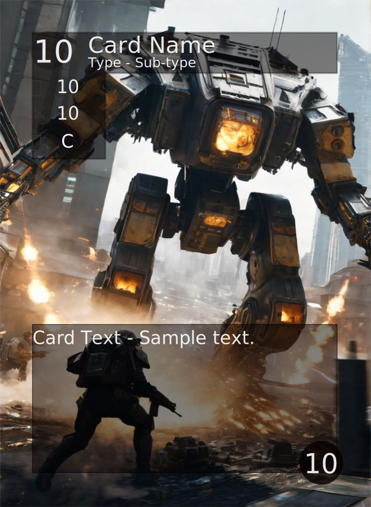
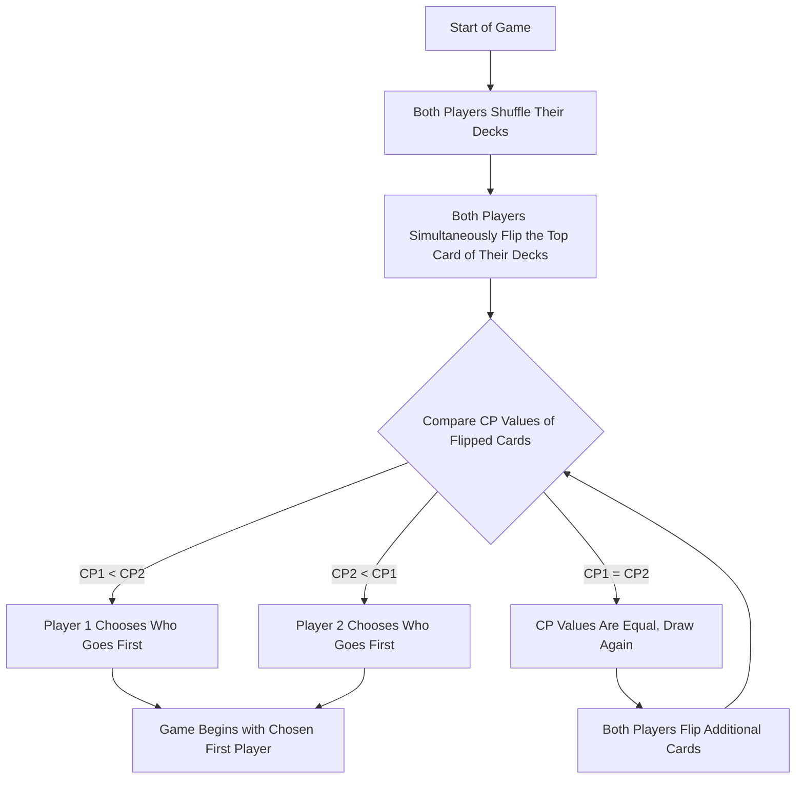
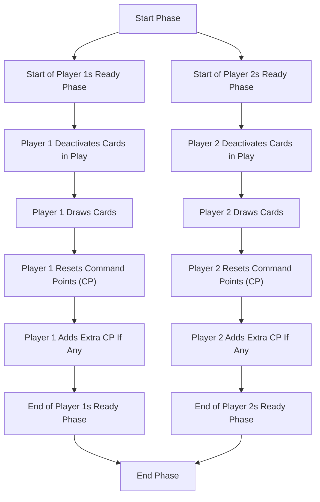
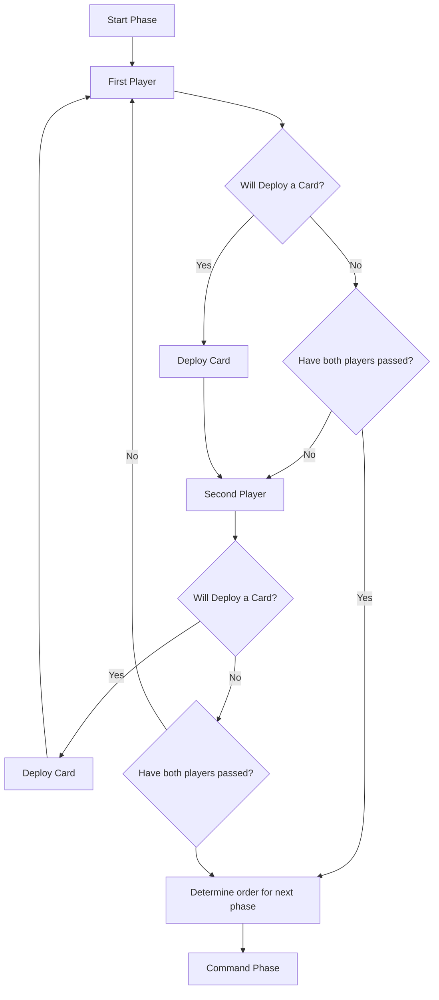
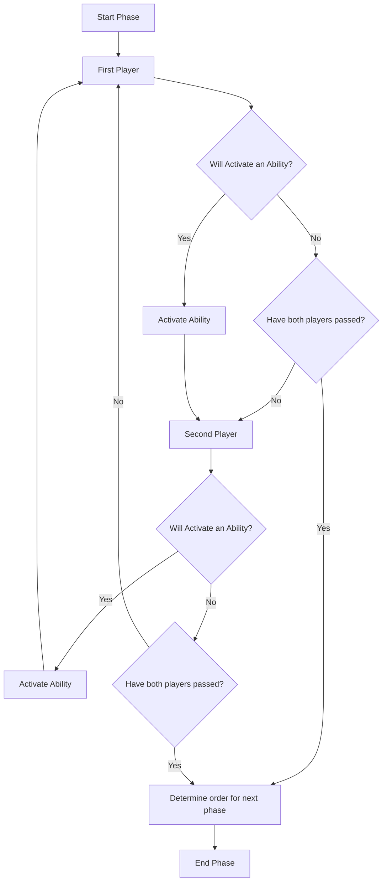
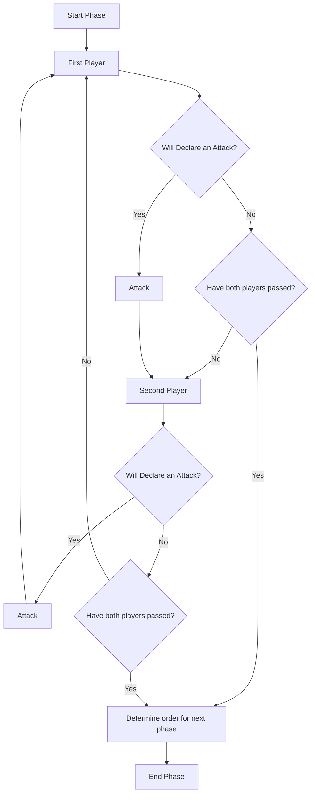
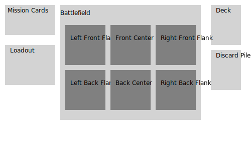

# Quantum Nexus Rules

## Quick Start Guide

### Introduction
Welcome to Quantum Nexus, the exciting sci-fi trading card game! This guide provides a simplified overview to get you started quickly. For more details, refer to the full rulebook.

### How to Win
1. Force your opponent to draw a card when their deck is empty.
2. Finish all missions in a match.

### Components
- **Cards**: These are the core of the game, including Units, Leaders, Assets, Events, Upgrades, Terrain, and Missions.

### Deck Construction
1. Build a deck with exactly 200 Command Points (CP) worth of cards.
2. Include up to six mission cards.
3. Pay attention to the duplicate limit for each card.

### Quick Overview of a Turn
1. Determine who goes first by comparing the CP value of the top cards of your decks.
2. Each turn has four phases: Ready, Deployment, Command, and Battle.
3. The Ready Phase sets the stage for your turn.
4. During the Deployment Phase, players alternate placing cards or pass.
5. In the Command Phase, you activate abilities or deploy Events.
6. The Battle Phase is where you declare attacks against opponent units.

### Playing a Card
- In Deployment and Command Phases, take turns to play cards.
- Follow range restrictions for attacks and abilities.
- Ensure you have the Command Points to play a card.

### Areas of Play
- **Mission Cards**: Place face-up in the mission card area.
- **Deck**: Keep your cards here. Draw from it.
- **Discard Pile**: Destroyed cards go here.
- **Loadout**: Assets are placed here.
- **Battlefield**: Where units are placed, divided into quadrants.

### Winning
- Achieve victory by either forcing your opponent to draw when they can't or completing all your missions.

This Quick Start guide gives you the essentials to begin your Quantum Nexus adventure. As you gain experience, explore the full rulebook for deeper strategies and detailed rules. Enjoy the game!

## Full Rules

### Introduction

Welcome to the exciting world of Quantum Nexus, the sci-fi trading card game that will challenge your strategic skills and immerse you in epic battles between advanced civilizations. In Quantum Nexus, you will embark on thrilling adventures, deploy powerful units, and engage in tactical warfare to achieve victory.

This rule book is your comprehensive guide to understanding the game's mechanics, strategies, and objectives. Whether you're a newcomer or a seasoned player, this rule book will provide all the information you need to dive into the Quantum Nexus universe.

### How to Win

In Quantum Nexus, there are several ways to win.

1. Force an opponent to draw a card when the deck is empty.
2. Finish all missions in a match.

### Components

#### Cards

Quantum Nexus is played by two or more people using only the cards in their decks. There are several different types of cards in Quantum Nexus:

- Units
  - They are used to Attack and Defend on the battlefield.
- Leaders
  - They are powerful units and only one may occupy a quadrant at any time.
- Assets
  - They are used as persistent effects on the battlefield.
- Events
  - Powerful one-time effects that are discarded immediately.
- Upgrades
  - Upgrades that change stats and give effects or abilities to other cards. They require another card to be played.
- Terrain
  - Adds or removes bonuses, effects, and abilities for specific units on the battlefield.
- Missions
  - Represent battle objectives that, once achieved, provide a passive bonus or a powerful one-off effect.

Each card type has a unique role in the game and is used together to defeat an opponent. All cards have a cost associated with them; this cost is called Command Points and is always located in the top left of the cards.

### Deck Construction

In Quantum Nexus, deck construction is a crucial step to ensure balanced and strategic gameplay. Here are the key rules for building your deck:

1. **Deck Size**: Your deck must consist of exactly 200 Command Points (CP) worth of cards. CP values are indicated on the top left of the cards.

2. **Mission Cards**: You can include a maximum of six (6) mission cards in your deck.

3. **Duplicates**: Pay attention to the duplicate limit for each card. Some cards have a duplicate count of one, meaning you can include only one copy of that card in your deck.

#### Selecting Missions

Mission cards have values in four domains: Technology, Magic, Psionics, and Divinity. When selecting mission cards, consider the following:

- The sum of all domain values on mission cards cannot exceed six.
- No single domain value should exceed 4.
- It's acceptable to have a domain with 0 points.

##### Example

Let's illustrate this with an example. Suppose you have three mission cards with the following domain values:

| Domain      | Points |
| ----------- | ------ |
| Technology  | 3      |
| Magic       | 0      |
| Psionics    | 1      |
| Divinity    | 2      |

The total CP value of these mission cards is 19, which you'll have for your turn.

#### Determining Command Points

The sum of the CP values on your selected mission cards determines your starting CP for the game.

In this example, you'll start with 19 CP for your turn.

#### Selecting Cards

When adding unit cards to your deck, ensure that the domain values on the cards do not exceed the sum of the corresponding domains on your mission cards.

For example, if your mission cards have:

- Technology: 3
- Magic: 0
- Psionics: 1
- Divinity: 2

You can include unit cards with domain values that match or are lower than these numbers. Unit cards must align with your mission's domains.

### Cards

All cards have attributes that are the same. Each card type is used uniquely, but all are necessary to win against an opponent. Each card has the following shared attributes.

#### Command Points

Command Points are always located at the top left of the card. They indicate the cost to add to the deck and to be deployed to the battlefield.

#### Type

Each card is one of several major types. Each type has a unique function on the board. Unit, Leader, Upgrade, Asset, Event, Mission, and Terrain are the six types.

#### Subtype

Each card also has a subtype that more precisely describes the card. Several subtypes are used across all of the cards. Sometimes, Effects and Abilities will target specific subtypes.

#### Rule Box

A card rule box holds a card's abilities, effects, and conditions. Any text written in the rule box will take precedence over these rules. The rule box defines a card’s functions and is vital for tactical planning.

##### Mandatory Interrupts

Mandatory Interrupts will have a trigger in the form of “Type-Action.” Since there is no cost, these interrupts must activate if possible. If a unit can activate, it must when the triggering condition is met.

An example of a few triggers would be:

Unit-Deploy: Triggered when a unit is deployed.

Mech-Attack: Triggered when a mech attacks.

Player-Draw: Triggered when a player draws a card.

##### Interrupts

Interrupts not only have a trigger, but they also have a cost. Since a cost is involved, these interrupts are optional and can only be triggered if the trigger is met, and the cost is then paid at that time.

##### Active Abilities

Active abilities will have a cost listed to the right of the effect. These abilities will activate the card and prevent it from making any further attacks, defences, or abilities.

##### Passive Abilities

Passive abilities have no markings in the rule box and only describe an effect. Passive abilities are active at all times.

#### Duplicates

Each card is limited to how many times it can be added to the deck. You can include the same card multiple times up to this limit. Some cards have a duplicate count of one, meaning only one card with that name can be included.

#### Card Types

##### Unit

Units have both an Attack and Defense attribute that is used for combat. When an attack value is larger than the opponent's defence value, the opponent loses the fight, and that card is discarded. Unit cards can only be deployed during the deployment phase and can only attack during the attack phase. Units will also display an attack range, one of close, mid, or far.

###### Leader

Some units are special powerful units called leaders. Only one leader can occupy a quadrant at a time.

##### Asset

Asset cards don't have an Attack value, but they do have a defence value. Asset cards are placed into the loadout area and can't be attacked by units’ basic attacks but can be targeted by abilities and events. Asset cards bring robust, persistent, or repeatable skills and effects to the battlefield. Asset cards can only be deployed during the deployment phase, and their abilities can be activated during the Command Phase.

##### Event

Event cards create a powerful single-use effect. Event cards don't have any other attributes but can only be played during the Command Phase of play.

##### Upgrades

Upgrade cards have Attack and Defence values but are modifiers, not base values. The modifiers will add or subtract from a unit’s attack or defence values. An upgrade can also give a unit additional effects, statuses, and abilities.

##### Terrain

Terrain can be deployed during the deployment phase and may have similar restrictions to a unit. Once the terrain is deployed, it will cause a passive status effect for all the units in the quadrant it was deployed to. There can only be two terrain cards active for each quadrant.

##### Mission

Mission cards are available for each player and have completion conditions. Once the requirements are met, the mission card will start providing a passive effect on the battlefield and count toward the victory condition. Each mission card also has an ability that is triggered immediately upon completion. The player can include no more than six (6) missions in a deck, and a player will be deemed victorious once all missions have been completed. A deck may include any number of missions if there are fewer than six.

#### Example

### How to Play

#### Determining First Turn (Initiative)

Turn order is determined at the beginning of the game to decide which player goes first.

1. Each player shuffles their deck thoroughly.
2. Both players flip up a card from the top of their shuffled decks.
3. The card with the lowest Command Point (CP) value determines which player goes first. The player with the lowest CP value chooses who goes first.
4. In case of a draw (both players reveal cards with the same CP value), they flip up another card from their decks.
5. Repeat the process until there is no longer a draw. After this process, the player with the lowest CP value chooses who goes first.
6. Once the first player is chosen, the game setup continues as detailed below.
7. When the game starts, play continues to the left of the first chosen player. The first turn can have long-lasting effects and allows a player to set the pace of the battle.

#### Game Setup

Each player removes their mission cards from their deck and places them face up where the opponent can easily see them.

###### Sequence of Play

1. Mission Card Placement: Before deploying units, players must place their mission cards face-up in the Mission Card area, ensuring they are visible to both players. This is done to establish the initial objectives for the match.

2. Starting CP Determination: Each player determines their starting Command Points (CP) for this phase. The starting CP is equal to the sum of CP values on their mission cards. For example, if a player's mission cards have a total CP value of 15, they start with 15 CP for this game.

#### Phases of Play

In Quantum Nexus, a player's turn consists of four phases: Ready Phase, Deployment Phase, Command Phase, and Battle Phase. Players perform each phase together, taking turns within each phase as needed.

##### Ready Phase (Simultaneous)

At the start of each player's turn, both players simultaneously perform the following steps during the Ready Phase:

1. Deactivate any cards: Both players deactivate any cards they have in play from the previous turn.
2. Draw cards: Simultaneously, both players draw cards from their deck to ensure they have five cards in their hand.
3. Reset Command Points (CP): Simultaneously, both players reset their Command Points (CP) to their starting value.
4. Add Extra CP: If any extra CP is given at the turn's beginning, both players add it to their CP pool simultaneously.

##### Deployment Phase (Alternating Turns)

- Players place cards one at a time, alternating between players.
- A player can play a card or pass their turn to signal they are finished with the Deployment Phase.

If more than one player stops playing cards simultaneously, the player with the lowest CP value of that turn goes first in the next phase. If CP values are the same, the next player from the current phase leader is selected among those not playing cards.

##### Command Phase (Alternating Turns)

- Players take turns activating abilities or deploying Events, one at a time.
- Resolve each ability or Event immediately.
- A player can choose not to activate abilities if they have none left to use during this phase.

##### Battle Phase (Declaring Attacks)

- Each player takes turns declaring attacks against other units.
- Declare both the attacker and the defender for each attack.
- Front-row units must be targeted first, followed by back-row units.
- If an attacker's Attack value exceeds the defender's Defense value, the defender is discarded.
- If the defender's Attack value exceeds the attacker's Defense value, the attacker is discarded.
- If Attack and Defense values match, both units remain in play.

#### Changing the Order of Play

During Quantum Nexus gameplay, players take turns within each phase. This ensures a structured and fair experience. Here's how it works:

- Sequential Turns: Players take turns within each phase, such as Deployment or Command.
- Determining the First Player: Players compare the Command Point (CP) values of the top cards of their decks to start the game. The player with the lowest CP value decides who goes first. Players draw additional cards in case of a tie until the tie is broken.
- Completing Actions: Players complete their actions within a phase, such as deploying cards in the Deployment Phase. The player who performs the fewest actions becomes the first player in the next phase.
- Resolving Ties: If multiple players have the same number of actions in a phase, the player with the lowest CP value for that turn becomes the first player in the next phase. If CP values are still tied, the next player to act among those tied is selected.

This turn structure ensures that each player has a chance to act in a fair and organized manner within each phase of the game.

### Areas of Play

There are several distinct areas in which cards are played in Quantum Nexus.

#### Mission Cards

The mission card area is where your mission cards are. They must be visible to both players to ensure transparency and fairness. They are placed in the play area when the game starts. They are commonly put above the loadout area so players can easily see them.

#### Deck

The deck is where all of the player's cards are kept. It is generally held to the right of the play area, with the mission cards above it and the discard pile below it. Players will draw cards from the deck.

#### Discard pile

The discard pile is where all of the destroyed cards go. Once a card has been destroyed or used, it is put into the discard pile face up.

#### Loadout

The loadout area is located on the left side of the player. This area is where all of the Asset cards in play are kept.

#### Battlefield

The battlefield is between the loadout and deck, where all the units are placed. The battlefield is subdivided into two horizontal lines, front and back rows, and three vertical lines, left flank, center, and right flank. In all, there are six quadrants. These quadrants define where each unit's range can be targeted.

##### Quadrants

Quadrants are a way of splitting the battlefield. There can be any number of units in each quadrant, but only one leader can be in any quadrant simultaneously.

###### Front Line

The front line is the line of troops towards the front of the battlefield. These troops must attack and be attacked first. Opponents can't attack the back line until the front line is empty.

###### Back Line

The back line is the line of units behind the front line. This line of units can attack after the front line units have attacked but can't be targeted until all of the units on the front line are defeated.

###### Flanks

The areas on the far left and far right of the battlefield are known as the flanks.

###### Center

The areas between the flanks are known as the center.

##### Ranges

Each unit card will state its range. This applies to the unit's attack and abilities. If an ability has a different range, it will be explicitly stated.

###### Close

Close-range attacks and abilities can only target directly ahead of themselves or directly to either side.

###### Mid

Mid-range attacks and abilities can target either directly ahead, the immediate sides or the diagonals.

###### Far

Far-range attacks and abilities must target one row away from them. If they are in the back row, they can target the opponent's front row; if they are in the front row, they can target the opponent's back row.