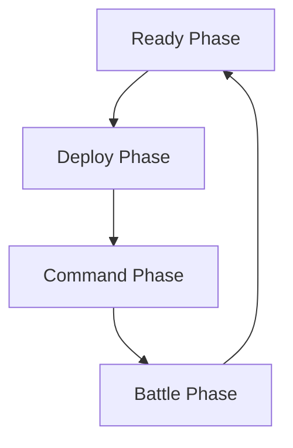
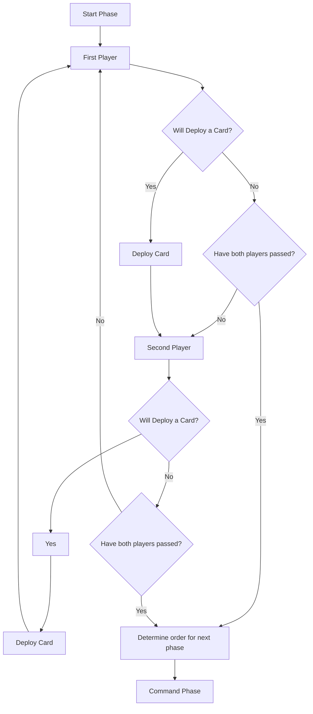

# Quantum Nexus Rules

## How to Win

In Quantum Nexus, there are several ways to win.

1. Force an opponent to draw a card when the deck is empty.
2. Finish all missions in a match.

## Components

### Cards

Quantum Nexus is played by two or more people using only the cards in their decks. There are several different types of cards in Quantum Nexus:

- Units
    - They are used to Attack and Defend on the battlefield.
- Assets
    - They are used as persistent effects on the battlefield.
- Events
    - Powerful one-time effects that are discarded immediately.
- Upgrades
    - Upgrades that change stats and give effects or abilities to other cards. They require another card to be played.
- Terrain
    - Adds or removes bonuses, effects, and abilities for specific units on the battlefield.
- Missions
    - Represent battle objectives that, once achieved, provide a passive bonus or a powerful one off effect.

Each card type has a unique role in the game and is used together to defeat an opponent. All cards have a cost associated with them; this cost is called Command Points and is always located in the top left of the cards.

## Deck Construction

Each player must construct their decks to a specific set of rules. These rules can be changed if agreed upon by the contestants or stipulated in a tournament setting.

1. Each player’s deck must have exactly 200 Commanders Points worth of cards.
2. A maximum of six (6) mission cards can be included in a deck.
3. No single card count is greater then the number of duplicates allowed.

### Selecting Missions

Each mission card as four domains: Technology, Magic, Psionics, Theism. Each mission card will have a 0 - 4 points in any one Domain, and a maximum of 6 points in total.

You may select mission cards where the sum of all domains on the mission cards does not exceed 6 and any single domain does not exceed 4. It is acceptable to have a domain with 0 points.

Selecting mission cards is crucial for winning, be careful that the cards you include are able to meet the requirements of the missions.

#### Determining Command Points

Each selected mission card has a Command Point (CP) value. The sum of these values will determine the starting CP. In the example above the total CP per turn is 19.

#### Example

Three mission cards are selected with the following values:

| Name | Mech Onslaught |
| --- | --- |
| CP | 6 |
| Type | Mission |
| Technogy | 2 |
| Magic | 0 |
| Psionics | 0 |
| Theism | 0 |
| Requirement | In a single turn, one `Mech` unit must defeat 3 opposing units and survive. |
| Passive | All mech units cost one less CP to Deploy. |
| Completion | All friendly `Mech` units gain +1/+1. |

| Name | Mission 2 |
| --- | --- |
| CP | 9 |
| Type | Mission |
| Technogy | 1 |
| Magic | 0 |
| Psionics | 1 |
| Theism | 1 |
| Requirement | In a single turn, `Exfiltrate` an opponents hand, top three cards of their deck and bottom card of the deck. |
| Passive | Opponent plays with the top card on their deck flipped up. |
| Completion | Remove one unit, terrain, and asset from your opponents board. |

| Name | Divine Crusade |
| --- | --- |
| CP | 4 |
| Type | Mission |
| Technology |0|
| Magic | 0 |
| Psionics | 0 |
| Theism | 1 |
| Requirement | in a single turn, three units with the keyword `Holy` must remove at least one opposing unit each. |
| Passive | At the start of each Battle phase choose one unit to gain +1 attack. |
| Completion | All opposing non-mechanical units are `Pinned` for the rest of this turn. |

In this example, we have three mission cards that give a total of 19 CP for the player to spend on their turn. It also gives the following values in each domain:

| Domain | Points |
|--|--|
| Technology | 3 |
| Magic | 0 |
| Psionics | 1 |
| Theism | 2 |

### Selecting Cards

Each card has the four domains listed with values. The domain values on the card can not exceed the sum of the domain values on the mission cards.

#### Example

| Name | Unit 1 |
| --- | --- |
| CP | 6 |
| Type | Unit |
| Technogy | 1 |
| Magic | 0 |
| Psionics | 1 |
| Theism | 0 |

| Name | Unit 2 |
| --- | --- |
| CP | 2 |
| Type | Unit |
| Technogy | 0 |
| Magic | 1 |
| Psionics | 0 |
| Theism | 0 |

| Name | Unit 3 |
| --- | --- |
| CP | 5 |
| Type | Unit |
| Technogy | 0 |
| Magic | 0 |
| Psionics | 2 |
| Theism | 0 |

With these example cards, Unit 1 can be added to the deck because both domain numbers are less then or equal to the sum of each corresponding domain on the mission cards.

Unit 2 cant be added because it requires a Magic value of 1 but our mission cards Magic value sum is 0.

Similarly, Unit 3 can't be added because the sum of the Psionics domain is 1 on the mission cards but the unit requires at least a 2 in Psionics.

## Cards

All cards have attributes that are the same. Each card type is used uniquely, but all are necessary to win against an opponent. Each card has the following shared attributes.

### Command Points

Command Points are always located at the top left of the card. They indicate the cost to add to the deck and to be deployed to the battlefield.

### Type

Each card is one of several major types. Each type has a unique function on the board. Commander, Unit, Tech, Event, Mission, and Terrain are the seven types.

### Subtype

Each card also has a subtype that more precisely describes the card. Several subtypes are used across all of the cards. Sometimes, Effects and Abilities will target specific subtypes.

### Rule Box

A card rule box holds a card's abilities, effects, and conditions. Any text written in the rule box will take precedence over these rules. The rule box defines a card’s functions and is vital for tactical planning.

#### Mandatory Interrupts

Mandatory Interrupts will have a trigger in the form of “Type-Action.” Since there is no cost, these interrupts must activate if possible. If a unit is able to activate they must when the triggering condition is met.

An example of a few triggers would be:

Unit-Deploy: Triggered when a unit is deployed.

Mech-Attack: Triggered when a mech attacks.

Player-Draw: Triggered when a player draws a card.

#### Interrupts

Interrupts not only have a trigger, but they also have a cost. Since there is a cost involved these interrupts are optional and can only be triggered if the trigger is met, and the cost is then paid at that time.

#### Active Abilities

Active abilities will have a cost listed to the right of the effect. These abilities will activate the card and prevent it from making any further attacks, defenses, or abilities.

#### Passive Abilities

Passive abilities have no markings in the rule box and only describe an effect. Passive abilities are active at all times.

### Duplicates

Each card has a limit to how many times it is allowed to be added to the deck. You can include the same card multiple times up to this limit. Some cards have a duplicate count of one, meaning only one card with that name can be included.

### Card Types

#### Unit

Units have both an Attack and Defense attribute that is used for combat. When an attack value is larger than the opponent's defence value, the opponent loses the fight, and that card is discarded. Unit cards can only be deployed during the deployment phase and can only attack during the attack phase. Units will also mention what row they are allowed to be deployed into: one of the front row, the back row, or both. This restriction must be adhered to when deploying a unit, but once deployed, a unit can move to either row if an event or ability allows.

#### Asset

Asset cards don't have an Attack value, but they do have a defence value. Asset cards are placed into the loadout area and can't be attacked by units’ basic attacks but can be targeted by abilities and events. Asset cards bring robust, persistent, or repeatable skills and effects to the battlefield. Asset cards can only be deployed during the deployment phase, and their abilities can be activated during the Command Phase.

#### Event

Event cards create a powerful single-use effect. Event cards don't have any other attributes but can only be played during the Command Phase of play.

#### Upgrades

Upgrade cards have Attack and Defence values but are modifiers, not base values. The modifiers will add or subtract from a unit’s attack or defence values. An upgrade can also give a unit additional effects, statuses, and abilities.

#### Terrain

Terrain can be deployed during the deployment phase and may have similar restrictions to a unit. It may only be able to be deployed to the front row, back row, or both. Once the terrain is deployed, it will cause a passive status effect for all the units in the row it was deployed to. There can only be two terrain cards active for each row.

#### Mission

Mission cards are available for each player and have completion conditions. Once the requirements are met, the mission card will start providing a passive effect on the battlefield and count toward the victory condition. Each mission card also has an ability; once triggered, it will remove the passive effect from the mission, and that card will be turned over, indicating that it will not be able to be used again for that game. The player can include no more than six (6) missions in a deck, and a player will be deemed victorious once all missions have been completed. A deck may include any number of missions as long as there are fewer than six.

## How to Play

### Determining First Turn (Initiative)

Turn order is determined at the beginning of the game to decide which player goes first.

1. Each player shuffles their deck thoroughly.
2. Both players simultaneously flip up a card from the top of their shuffled decks.
3. The card with the lowest Command Point (CP) value is used to determine which player goes first. The player with the lowest CP value chooses who goes first.
4. In case of a draw (both players reveal cards with the same CP value), both players flip up another card from their decks.
5. Repeat the process until there is no longer a draw. The player with the lowest CP value after this process chooses who goes first.
6. Once the first player is chosen, the game setup continues as detailed below.
7. When the game starts, play then continues to the left of the first chosen player. The first turn can have long-lasting effects and allows a player to set the pace of the battle.

### Phases of Play

In Quantum Nexus, a player's turn consists of four phases: Ready Phase, Deployment Phase, Command Phase, and Battle Phase. Players perform each phase together, taking turns within each phase as needed.

#### Ready Phase (Simultaneous)

At the start of each player's turn, both players simultaneously perform the following steps during the Ready Phase:

1. Deactivate any cards: Both players deactivate any cards they have in play from the previous turn.
2. Draw cards: Simultaneously, both players draw cards from their decks to ensure they have five cards in their hand.
3. Reset Command Points (CP): At the same time, both players reset their Command Points (CP) to their starting value.
4. Add Extra CP: If any extra CP is given at the turn's beginning, both players add it to their CP pool simultaneously.

#### Deployment Phase (Alternating Turns)

- Players take turns placing cards one at a time, alternating between players.
- A player can play a card or pass their turn to signal they are finished with the Deployment Phase.

If more than one player stops playing cards simultaneously, the player with the lowest CP value of that turn goes first in the next phase. If CP values are the same, the next player among those not playing cards from the current phase leader is selected.

#### Command Phase (Alternating Turns)

- Players take turns activating abilities or deploying Events, one at a time.
- Resolve each ability or Event immediately.
- A player can choose not to activate abilities if they have none left to use during this phase.

#### Battle Phase (Declaring Attacks)

- Each player takes turns declaring attacks against other units.
- Declare both the attacker and the defender for each attack.
- Front-row units must be targeted first, followed by back-row units.
- If an attacker's Attack value exceeds the defender's Defense value, the defender is discarded.
- If the defender's Attack value exceeds the attacker's Defense value, the attacker is discarded.
- If Attack and Defense values match, both units remain in play.

### Changing Order of Play

During Quantum Nexus gameplay, players take turns within each phase. This ensures a structured and fair experience. Here's how it works:

- Sequential Turns: Within each phase, such as Deployment or Command, players take turns one after the other.
- Determining the First Player: To start the game, players compare the Command Point (CP) values of the top cards of their decks. The player with the lowest CP value decides who goes first. In case of a tie, players draw additional cards until the tie is broken.
- Completing Actions: Players complete their actions within a phase, such as deploying cards in the Deployment Phase. The player who finishes their actions first becomes the first player in the next phase.
- Resolving Ties: If multiple players finish their actions simultaneously in a phase and have the same CP value, the player with the lowest CP value for that turn becomes the first player in the next phase. If CP values are still tied, the next player to act among those not playing cards in the current phase is selected.
This turn structure ensures that each player has a chance to act in a fair and organized manner within each phase of the game.

## Areas of Play

There are several distinct areas that cards are played in Quantum Nexus.

### Mission Cards

The mission card area is where your mission cards are. They must be visible to both players to ensure transparency and fairness. They are commonly put above the players deck.

### Deck

The deck is where all of the players cards are kept. It is generally kept to the right of the play area with the mission cards above it and the discard pile below it. Players will draw cards from the deck.

### Discard pile

The discard pile is where all of the destroyed cards go. Once a card has been either destroyed or used if it is an event that card is put into the discard pile face up.

### Loadout

The loadout area is located on the left side of the player. This area is where all of the Asset cards in play are kept.

### Battlefield

The battlefield is between the loadout and deck, where all the units are placed. The battlefield is further subdivided into two horizontal lines.

#### Front Line

The front line is the line of troops towards the front of the battlefield. These troops must attack and be attacked first.

#### Back Line

The back line is the line of units behind the front line. This line of units can attack after the front line units have attacked but can't be targeted until the front line is defeated.

## Game Setup

Each player removes their mission cards from their deck. They then shuffle their deck, place it near the mission cards and draw a hand of five cards.

### Start of Turn Sequence

At the start of each player’s turn, they must: 

1. Deactivate the cards already played.
2. They must pick up cards to end up with five cards. 
3. They must reset their command points.
4. They must add any extra command points given at the turn’s beginning.
